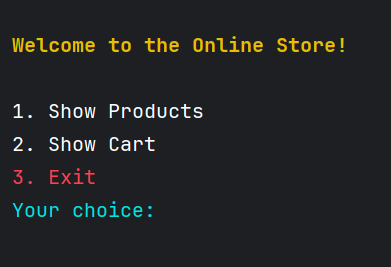
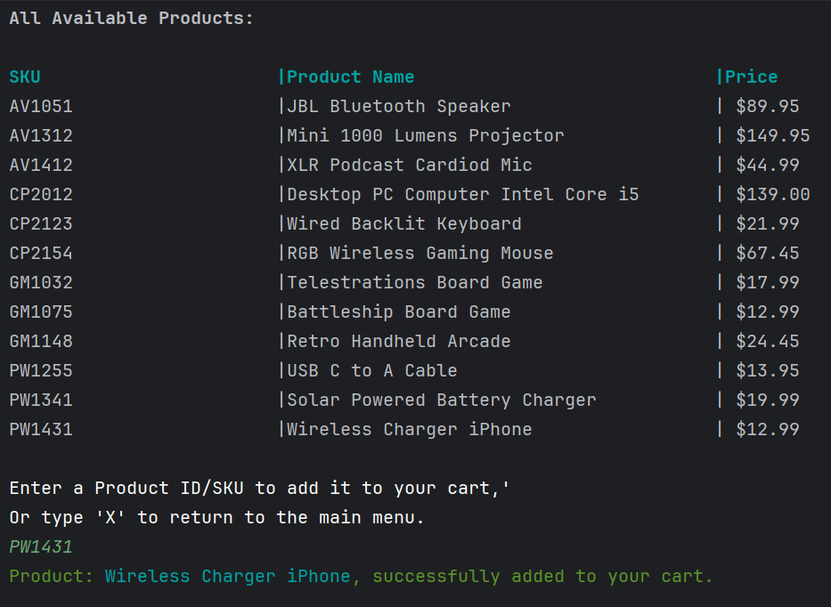
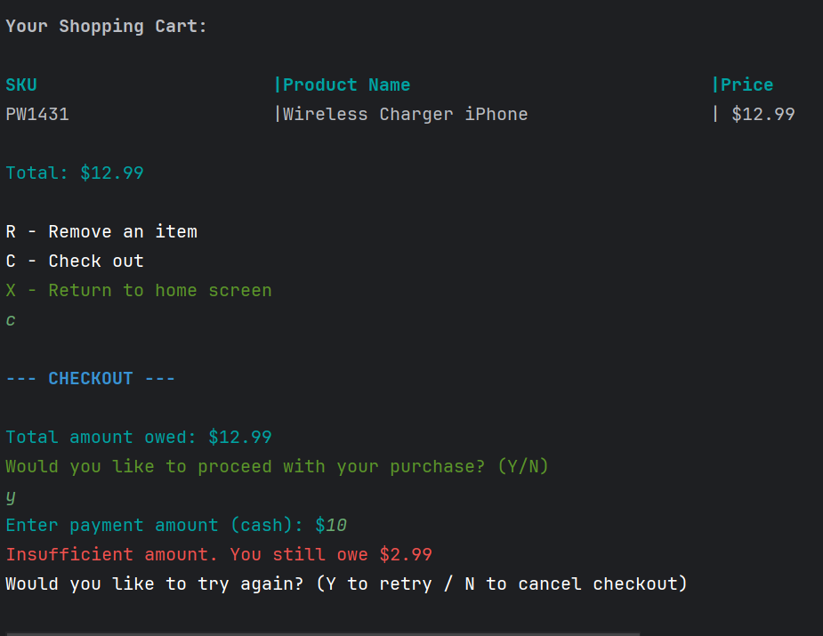
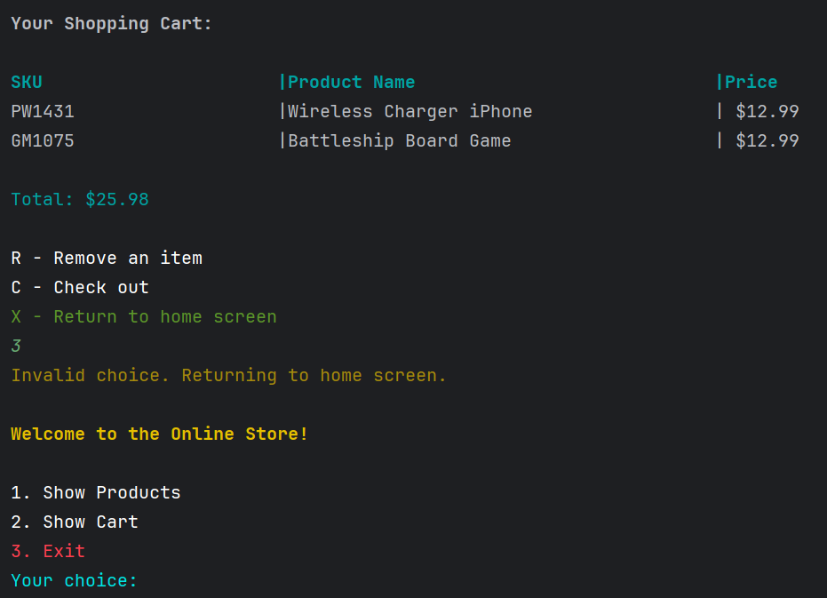
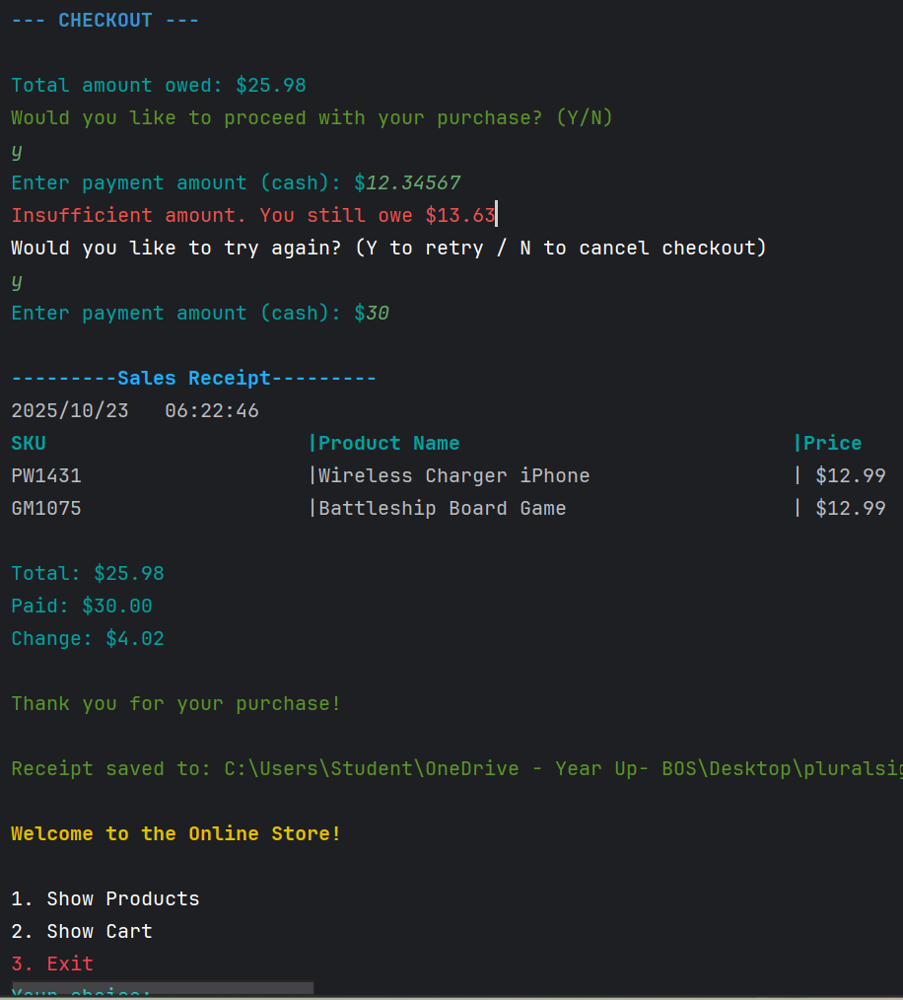
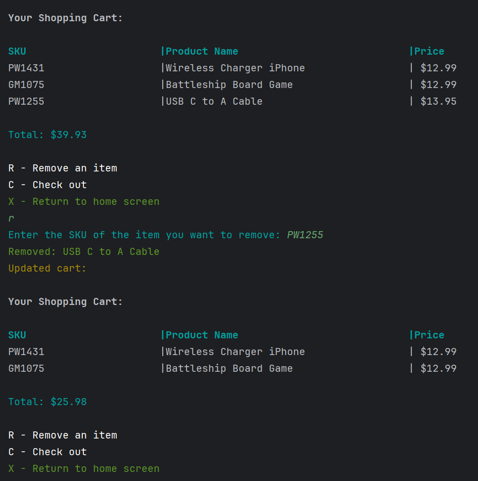

# 🛒 Online Store Application

## Description of the Project

This Java Console-Based Online Store is a simple command-line application that lets users browse products, add or remove items from their cart, and complete purchases using cash payment. After checkout, the program generates a timestamped sales receipt saved in a Receipts folder.

Designed for beginners and students, this project simulates the basic shopping experience in an easy-to-use, text-based format.

### Features

View all available products with IDs, names, and prices

Add or remove products from the shopping cart

Calculate total cost and handle cash payments

Display and save a detailed sales receipt

Automatically create a Receipts folder if it doesn’t exist

## User Stories

List the user stories that guided the development of your application. Format these stories as: "As a [type of user], I want [some goal] so that [some reason]."

- As a customer, I want to see a list of main menu options when I open the store so that I can easily navigate to view products, view my cart, or exit the store.
- As a customer, I want to see a list of all available products so that I can decide which items I might want to buy.
- As a customer, I want to search for a product by entering its SKU so that I can quickly find and view details about a specific product.
- s a customer, I want to add a product to my shopping cart so that I can purchase it later during checkout.
- As a customer, I want to view all items currently in my shopping cart so that I can review what I plan to purchase and see the total cost.
- As a customer, I want to checkout and pay for my items so that I can complete my purchase.
- As a customer, I want to remove an item from my cart so that I can adjust my purchase before checkout.
- As a customer, I want a copy of my receipt saved as a file so that I can keep a record of my purchase.

## Setup

Instructions on how to set up and run the project using IntelliJ IDEA.

### Prerequisites

- IntelliJ IDEA: Ensure you have IntelliJ IDEA installed, which you can download from [here](https://www.jetbrains.com/idea/download/).
- Java SDK: Make sure Java SDK is installed and configured in IntelliJ.

### Running the Application in IntelliJ

Follow these steps to get your application running within IntelliJ IDEA:

1. Open IntelliJ IDEA.
2. Select "Open" and navigate to the directory where you cloned or downloaded the project.
3. After the project opens, wait for IntelliJ to index the files and set up the project.
4. Find the main class with the `public static void main(String[] args)` method.
5. Right-click on the file and select 'Run 'YourMainClassName.main()'' to start the application.

## Technologies Used

- Java: JDK corretto-17 Amazon Corretto 17.0.16
  Build system: Maven
- IntelliJ IDEA 2025.2.1 (Community Edition)

## Demo

Include screenshots or GIFs that show your application in action. Use tools like [Giphy Capture](https://giphy.com/apps/giphycapture) to record a GIF of your application.

## Interesting Piece of Code

File folder = new File("Receipts");
if (!folder.exists()) folder.mkdir();

DateTimeFormatter formatter = DateTimeFormatter.ofPattern("yyyyMMddHHmmss");
String timestamp = LocalDateTime.now().format(formatter);
File receiptFile = new File(folder, timestamp + ".txt");

FileWriter writer = new FileWriter(receiptFile);
writer.write(receipt.toString());
writer.close()

Why It’s Interesting:
It automatically creates a Receipts folder (if it doesn’t exist) and saves each customer’s receipt with a unique timestamped filename, ensuring no two receipts overwrite each other.

## Future Work

Outline potential future enhancements or functionalities you might consider adding:

- Additional feature to be developed:
  - When a customer adds multiple items to a cart
    - Instead of showing the item multiple times, your
    cart should only display each item once, but
    display the quantity for each item
  
- Improvement of current functionalities.

## Resources

List resources such as tutorials, articles, or documentation that helped you during the project.

- [potato-sensei](https://chatgpt.com/g/g-681d378b0c90819197b16e49abe384ec-potato-sensei)
- [File mkdir() method in Java with examples](https://www.geeksforgeeks.org/java/file-mkdir-method-in-java-with-examples/)

## Team Members

Qi Qing Lin

## Thanks

- Thank you to instructor Raymon Maroun for continuous support and guidance.